## 日常开发因为惯用mac，江科大教程中的IDE无法使用(且看起来相当古朴)

#### 配置清单

* 笔记本型号: ```Apple M3 Max```

* macos系统版本: ```Tahoe26.1```

* clion版本: ```2025.2.4```


## 主要参考clion官方教程及知乎的帖子，链接如下：

[clion官方教程](https://www.jetbrains.com/zh-cn/help/clion/2025.2/embedded-stm32.html)

[知乎教程](https://zhuanlan.zhihu.com/p/628628503)(windows环境且ide版本较老)

## 环境依赖

### 1. 系统环境依赖

#### ***安装STM32相关开发环境***
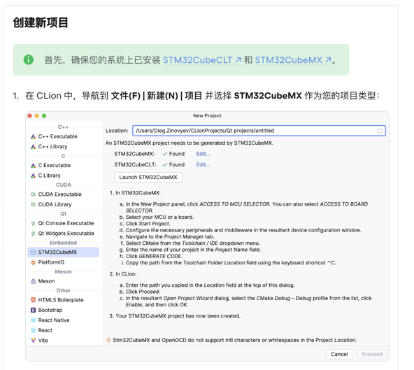

* [STM32CubeCLT 官方下载地址](https://www.st.com.cn/zh/development-tools/stm32cubeclt.html)

* [STM32CubeMX 官方下载地址](https://www.st.com.cn/zh/development-tools/stm32cubemx.html)

安装完成后，再次打开clion会自动识别到对应软件位置

### 2. 新建STM32项目

打开STM32CubeMX，选取对应开发板芯片，以江科大教程中的STM32F103C8T6为例

* 选中芯片，进入项目设置

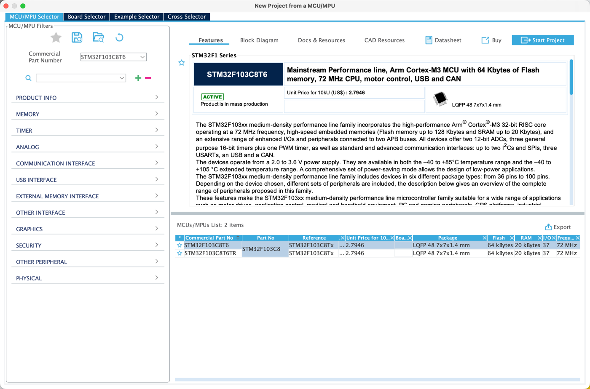


* 进入项目后直奔Project Manage界面
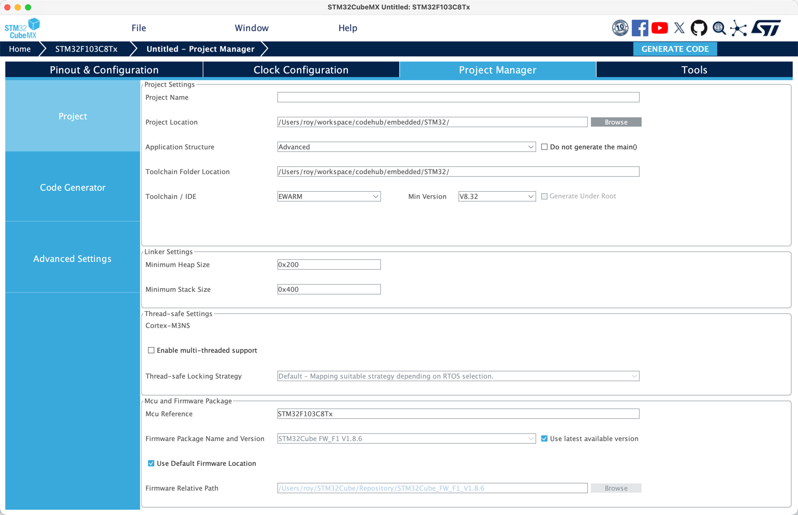


* Toolchain/IDE选项改为CMake


* Code Generator选项如下
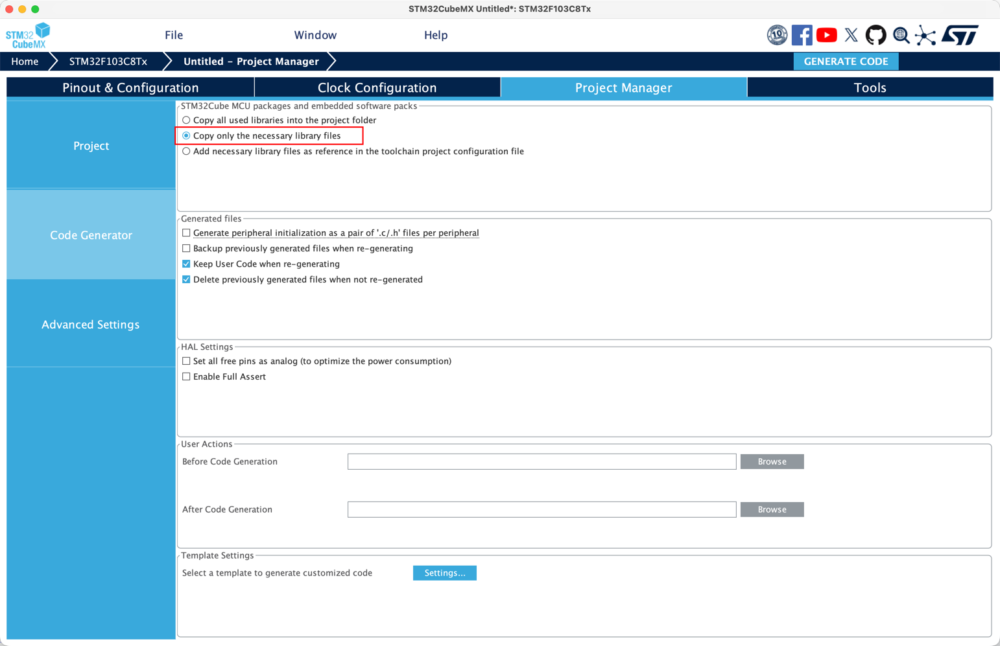


* 最后点击GENERATE CODE完成项目创建

### 3. clion导入项目

* clion打开项目目录或选取CMakeLists.txt作为项目打开


* 项目打开后应该会弹出如下界面
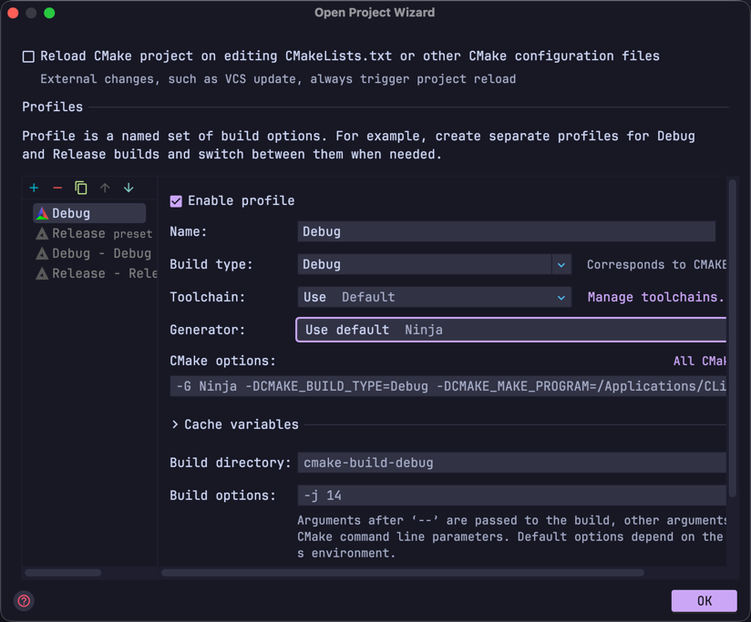


* Generator选项改为 Let Cmake decide
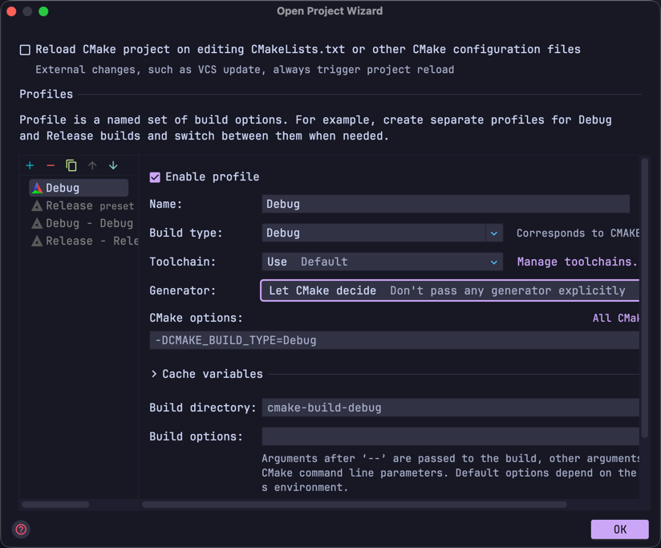


* 点击ok, clion会自动执行CMake编译, 正常结果如下
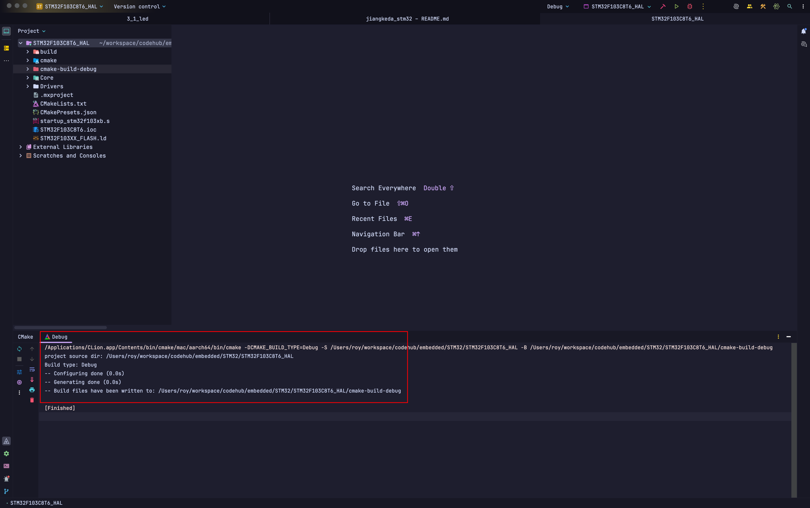

### 4. 标准库开发模式改造 

#### 正常STM32CubeMX生成项目目录应该如下图所示
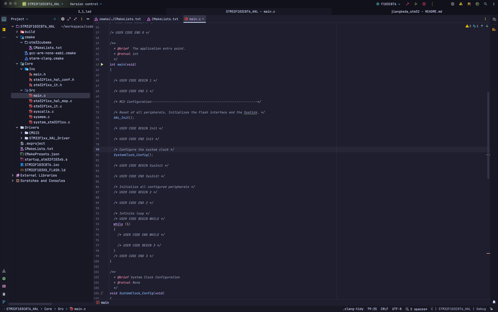

* 根据芯片系列选择固件库
   [官方固件库下载地址](https://www.st.com.cn/zh/embedded-software/stm32-standard-peripheral-libraries.html)

* 此处建议先复制一份STM32CubeMX生成的项目，防止后续操作误删了某些文件

* 生成后的项目的核心文件如下，这些文件/路径需要保留
```
  CMakeLists.txt #CMake构建配置
  CMakePresets.json #CMake预设文件, 预设文件与上文中提到的打开clion项目后选择默认的Debug配置选项相关联，也即会自动配置编译工具链
  STM32F103XX_FLASH.ld #STM32 微控制器的链接脚本，核心作用是告诉编译器（如 GCC）如何分配芯片的内存资源，将编译生成的代码、数据等 “映射” 到硬件实际的存储区域中
  startup_stm32f103xb.s #汇编启动文件, 必须保留
  cmake/CMakeLists.txt #CMake项目配置，包含include、源码等路径管理以及编译控制条件等
  cmake/gcc-arm-none-eabi.cmake #CMake编译工具链，指定编译器、目标硬件、编译选项及上述ld文件链接选项等
```
个人项目目录结构如下所示，可按照个人喜好进行随意调整
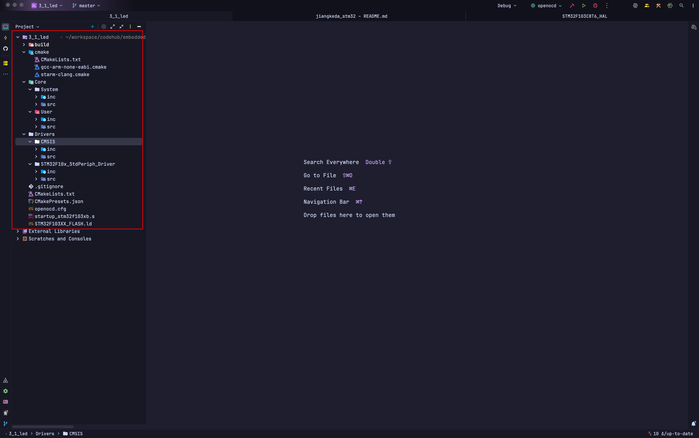

***按个人喜好新建好相应路径后, 需将HAL库调整为STD包, 主要改动如下***

   * Drivers/STM32F1xx_HAL_Driver调整 

      可以直接替换为标准库固件包下 Libraries/STM32F10x_StdPeriph_Driver 目录，此处我只保留了inc和src目录
      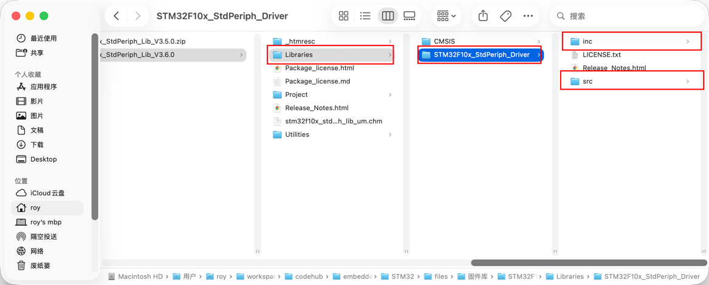

      替换后目录文件如下，同时需调整cmake/CMakeLists.txt中STM32_Drivers_Src配置项
      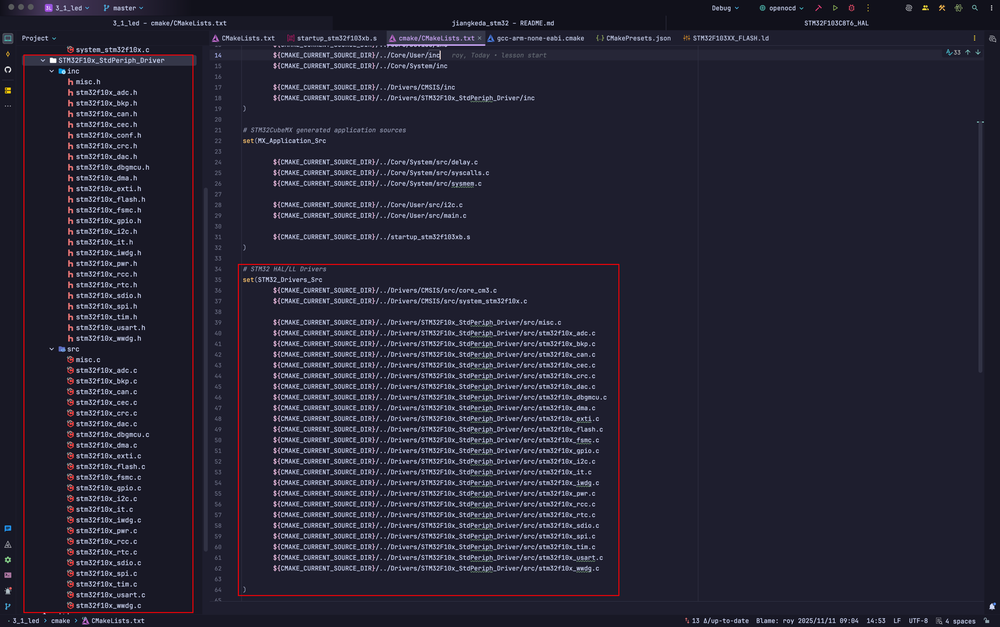


   * CMSIS目录调整

        删除或调整原有项目中CMSIS下的Device和Include目录，按个人喜好将固件包下的 
        /Libraries/CMSIS/CM3/CoreSupport以及/Libraries/CMSIS/CM3/DeviceSupport/ST/STM32F10x下的头文件及c文件复制到
        CMSIS相应目录下，个人配置如下
        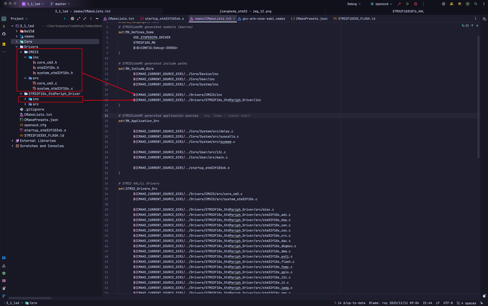
        详细配置可参照项目中[cmake/CMakeLists.txt](3_1_led/cmake/CMakeLists.txt)详细配置，注意不要遗漏inc目录以及.c文件路径配置
     

   * ***CMakeLists.txt文件调整***

     cmake/CMakeLists.txt需调整如下配置:
     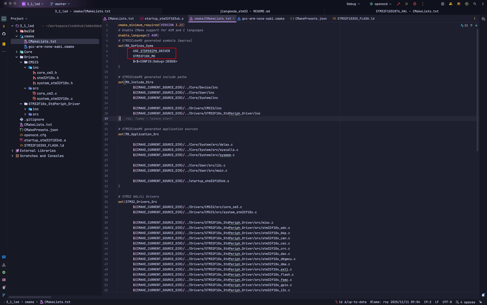

      子CMakeLists.txt路径配置及项目名称调整如下:
     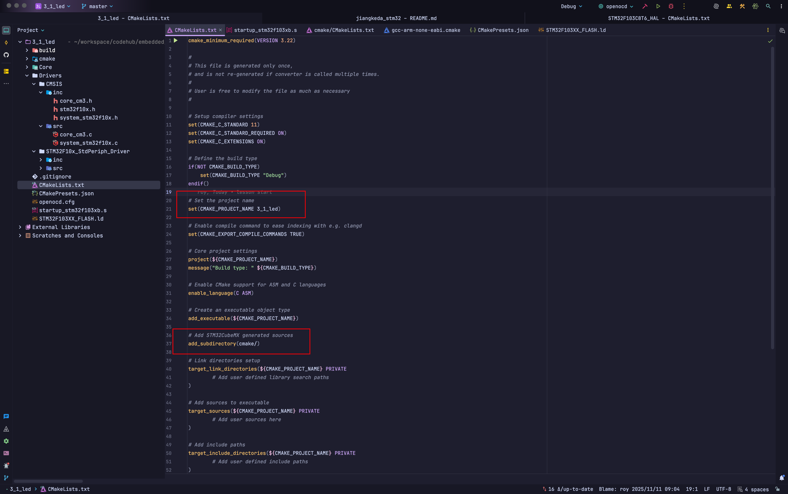

### 5.clion烧录调试

#### ***安装openocd***

```shell
    brew install openocd
```

#### clion配置

* 新增opocd配置文件: [openocd.cfg](3_1_led/openocd.cfg)，需根据芯片型号选取对应配置项

* clion新建OpenOCD配置，Board config file选取上一步中openocd配置文件，GDB和Telnet端口默认分别为: 3333、4444
    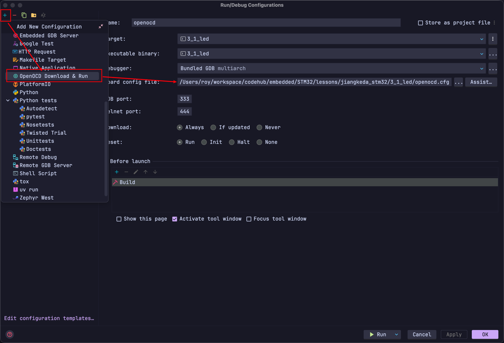

* 点击运行/debug即可运行程序烧录/调试

    
     
      
      